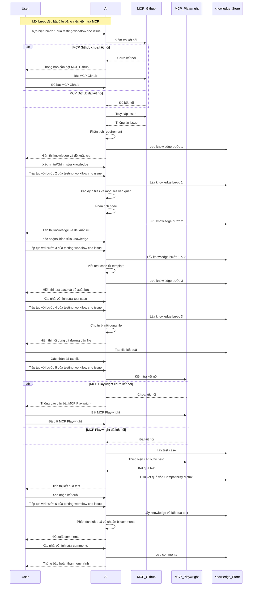

# Sequence Diagram: Testing Workflow

## Chú thích

1. **User**: Người dùng thực hiện testing
2. **AI**: Cursor AI trợ giúp trong quy trình
3. **MCP_Github**: Kết nối với GitHub để đọc issues
4. **MCP_Playwright**: Công cụ thực hiện automated testing
5. **Knowledge_Store**: Nơi lưu trữ thông tin trong `.cursor/knowledges/issues/`

## Các hành động chính

### Bước 1: Đọc issue từ GitHub
- User yêu cầu đọc issue
- AI kiểm tra MCP Github
- AI trích xuất thông tin từ issue
- AI lưu và xác nhận knowledge

### Bước 2: Đọc codebase
- User yêu cầu đọc codebase
- AI phân tích code liên quan
- AI lưu và xác nhận knowledge

### Bước 3: Viết test case
- User yêu cầu viết test case
- AI tạo test case từ template
- AI lưu và xác nhận test case

### Bước 4: Tạo file kết quả
- AI đề xuất nội dung file
- User tạo file thực tế
- User xác nhận đã tạo

### Bước 5: Thực hiện test
- AI kiểm tra MCP Playwright
- AI hỗ trợ thực hiện test
- User xác nhận kết quả

### Bước 6: Bổ sung comments
- AI đề xuất comments
- User xác nhận/chỉnh sửa
- AI lưu comments